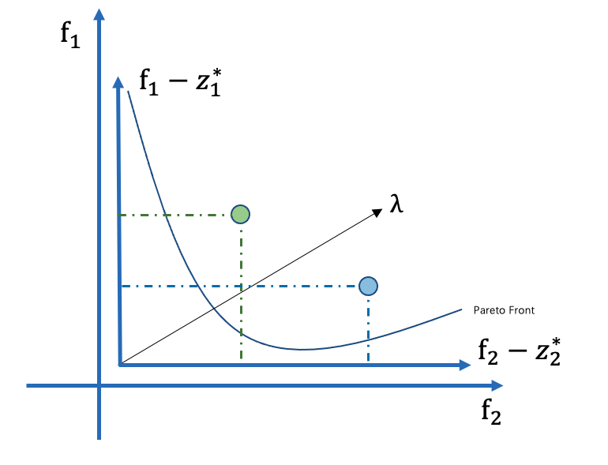

# A Survey on Evolutionary Constrained Multi-objective Optimization
本文是一篇综述性质的文章，我选取其中的涉及到的部分文章进行整理和阅读并且提出自己的思考。涉及到的文章的质量也不一定都特别好，质量良莠不齐，有些解释不清的地方我也尽量整理出来了。

参考内容使用蓝色的超链接指出，对应的文章要么就是非常经典的文章，要么我直接使用文章名字作为标题，方便大家检索。

本文大纲如下：
1. Preliminaries
    - scalar optimization
    - convex optimization
    - rough set
    - niched 
2. Commonly Used Metrics
    - GD、IGD
    - HV
3. Search Engines
    - MOEA/D Series
        - Weighted Sum Approach
        - Tchbycheff Approach
        - Penalty-based Boundary Intersection Approach
    - NSGA Series
        - NSGA-II
        - NSGA-III
    - IBEA Series
4. cMOEAs

# Definitions
## Scalar Optimization
标量优化，MOEA/D的目的就是将多目标问题分解成标量优化算法。
## Convex Optimization
[凸函数 & 凸优化问题](https://www.zhihu.com/question/20343349/answer/140478173)
- 凸集合
如果$X$是凸集合，则对于集合中的任意两点$x_1, x_2 \in X$都有：
$tx_1 + (1 - t)x_2 \in X, t \in [0, 1]$，如图所示，下面就是一个非凸集合

如果$f$是凸函数，则对于定义域中的任意两点$x_1, x_2$都有：
$f(tx_1 + (1 - t)x_2) >= tf(tx_1) + (1 - t)f(x_2), t \in [0, 1]$

常见的二次以上的多项式函数，以及sin cos函数都是非凸的，比如下面的$f(z) = x^3 + y^3$：

在凸优化中局部最优解即为全局最优解，使用梯度下降或者是贪婪算法都求出的局部最优解即为全局最优解。非凸优化存在有很多局部最优解的情况，使用传统的蒙特卡洛投点法也难以求出全局最优解。

## Rough Sets

> Definitions 

[参考内容-Rough Set Theory | Rough Set Theory Part-I | Indiscernibility | Set Approximation | (Dr Utpal Pal)](https://www.youtube.com/watch?v=Xtlx-Kx59Ms&t=159s)

1. 信息系统（Information System）：

信息系统是一个对（Pari）$(U, A)$组成。其中$U$表示一个**非空有限的**对象（Objects）集合，$A$表示一个**非空有限的**属性（Attribute）集合。如下图所示，其中的$U = \{X_1, X_2, \dots, X_5\}$，$A = \{AGE, LEMS\}$

2. 决策系统（Decisiion System）：

使用了决策属性（decision attribute）的信息系统被称为决策系统。决策系统被表示为：
$(U, A \cup \{d\}), \, and \, d \notin A$
下图中$Walk$就表示决策属性

3. 模糊关系（indiscernible relation）

（indiscernible relation = equivalent classes）
举例而言，在下图中，对于属性$AGE$，$X_1, X_2, X_6$都具有模糊关系，因为对于属性$AGE$，他们具有相同的值。

- 根据属性$AGE$的相同与否，我们可以划分出一个模糊关系的集合：
$IND(\{AGE\}) = (\{X_1, X_2, X_6\}, \{X_3, X_4\}, \{X_5, X_7\})$
- 根据属性$AGE, LEMS$的相同与否，我们可以划分出一个模糊关系的集合：
$IND(\{AGE, LEMS\}) = (\{X_1\}, \{X_2\}, \{X_3, X_4\}, \{X_5, X_7\}, \{X_6\})$

4. Set Approximation
以下的例子针对的是决策属性 $YES$。为了找到下面定义的三种属性的集合，首先需要找到模糊关系：
$IND(\{AGE, LEMS\}) = (\{X_1\}, \{X_2\}, \{X_3, X_4\}, \{X_5, X_7\}, \{X_6\})$
- Lower Approximation
对于所有的模糊关系，其中的每一个对象（Object）都要属于$YES$
在所有的模糊关系中，只有$\{X_1\}, \{X_6\}$的决策属性$Walk$属于$YES$，所以归类到Lower Approximation中。对于$\{X_5, X_7\}$中的两个对象，$Walk$属性都是$No$
- Upper Approximation 
对于所有的模糊关系，其中至少有一个对象的决策属性属于$YES$：
比如$\{X_3, X_4\}$，$X_3$属于No，但是$X_4$属于YES。最终的结果为$\{X_1, X_6, X_3, X_4\}$
- Boundary Region
Boundary Region等于$Upper Approximation - Lower Approximation$:
$\{X_1, X_6, X_3, X_4\} - \{X_1, X_6\} = \{X_3, X_4\}$

- 一个例子：

## niche
[参考内容-多目标优化介绍（小生境）](https://blog.csdn.net/SZU_Hadooper/article/details/78212092)

**小生境（Niche）**：来自于生物学的一个概念，是指特定环境下的一种生存环境，生物在其进化过程中，一般总是与自己相同的物种生活在一起，共同繁衍后代。例如，热带鱼不能在较冷的地带生存，而北极熊也不能在热带生存。把这种思想提炼出来，运用到优化上来的关键操作是：当两个个体的海明距离小于预先指定的某个值(称之为小生境距离)时，惩罚其中适应值较小的个体。

**海明距离（Hamming Distance）**：在信息编码中，两个合法代码对应位上编码不同的位数称为码距，又称海明距离。例如，10101和00110从第一位开始依次有第一位、第四、第五位不同，则海明距离为3。

### A Niched Pareto Genetic Algorithm for Multiobjective Optimization

本文提出的时间比较早，主要看看文章中提出的niching process（小生境操作）的实现。
[参考内容-进化计算-遗传算法之史上最全选择策略](https://blog.csdn.net/hba646333407/article/details/103251008)

- Tournament Selection

传统的竞标赛算法默认我们只需要一个结果，在多目标问题中，本文提出了如下的修改方式：
1. Pareto Domination Tournament
2. Non-dominant Tournament
**Sharing on the non-dominated frontier**

> Symbols

**niche count**
niche count $m_i$用于估计个体$i$周围的邻居的拥挤程度。这一点有点类似于NSGA-II中的crowding Distance的计算的目的（[fitness sharing vs crowding distance](https://www.jianshu.com/p/a38b61d90d0c)）

$m_i$ :niche count 生态位（小生境）数量
$m_i =  \mathop{\sum}\limits_{j\in Pop} Sh[d[i, j]]$，其中$d[i, j]
$表示个体$i, j$之间的距离，$Sh[d]$表示Sharing Function。

**Fitness Sharing**
Fitness Sharing的目的是为了让种群分布在搜索空间中的不同的山峰上。为了实现这个目的，*fitness sharing*会将个体的fitness进行【降级】（degradation）

**Degradation**
在本文中，【降级】的主要方法是将个体的fitness除以**niche count**，从而获取**Shared Fitness**, $shared\_fitness = f_1 / m_i$

**Sharing Function**
通常采用的Sharing Function是三角分享函数（triangular sharing function）:
$if \; d \leq \sigma_{share} : \, Sh[d] = 1 - d/\sigma_{share}$
$if \; d > \sigma_{share} : \, Sh[d] = 0$
$\sigma_{share}$表示小生境半径（niche radius）是用户定义的变量。

在$\sigma_{share}$以内的个体属于一个niche，他们之间的fitness都相互被【降级】

如下图所示，Candidate 1 和2以Pareto支配的视角来说，没有更好和更差之分，但是我们可以使用Fitness Sharing来看待。在同样的$\sigma_{share}$框定的范围之中，Candidate1更加密集，Candidate2稍微稀疏一些，所以为了保证多样性，我们使用Candidate2，而不是1.

**Pareto Domination Tournament**

在传统的锦标赛选择中，我们通常使用两个个体进行比较，胜利的个体会走向下一个子代。但是这样的方式提供的比较小的选择压力（Selection Pressure，在后文中也被称作Domination Pressure）。为了增加这种选择压力，同时提供更加方便的控制，本文在Pareto Domination Tournament中采取了如下的方式：

比较的结果存在以下的情况：
1. 如果其中的一个个体被Comparison Set支配，另外的没有。则另一个个体胜利
2. 如果两个个体都被Comparison Set支配或者都没有支配（说明二者在同一个Nondominant Level ），我们需要使用Fitness Sharing选出一个较好的。

# Commonly Used Metrics 
## Convergence and Diversity
- **收敛性**
表示已知的Pareto前沿相对于真实Pareto前沿的距离
- **多样性**
多样性表示最终得到的Pareto前沿中的点的分布情况。

[IGD反转世代距离-多目标优化评价指标概念及实现](https://www.cnblogs.com/cloud-ken/p/12722867.html)

## Generational Distance
$ GD = \frac { (\sum_{i=1}^n {d^p_i})^{1/p} }{n} $

计算思路：对于已知前沿中的每一个点$i$，遍历$PF_{true}$中的所有的点，找到当前点$i$在$PF_{true}$上的最近点的欧氏距离距离，记录为$d_i$。

其中n表示$PF_{unknown}$中点的个数，p表示目标的维数$d_i$表示$PF_{unknown}$中的每一个点距离$PF_{true}$的最近的欧氏距离的平均值。
## Inverted Generational Distance

GD只能计算已知Pareto前沿的收敛性。IGD是从真实Pareto前沿向已知Pareto前沿做射线。遍历真实Pareto前沿中的每一个点$i$，找到最近的已知Pareto前沿中的点，并且记录为$d_i$，之后进行平均：

$ GD = \frac { (\sum_{i=1}^n {d_i})}{n} $，

这个值越小表示算法的综合性能越好。

## Hypervolume
[introduction to Hypervolume-youtube](https://www.youtube.com/watch?v=cR4r1aNPBkQ)
上面的计算方式可能存在问题，在真实世界的问题中，参考Pareto前沿（$PF_{true}$）可能并不存在，我们可以通过对比已知的Pareto前沿构成的Hypervolume来衡量好坏：
 
 

对于需要同时减少objective1和objective2的问题，Alphonse和Cornello这两种算法使用同一个参考点（$f_{ref}$），可以看出Cornnello具有更大的体积，所以Cornello表现更好。

# Search Engines

# MOEA/D Series

> reference:

[H26 MOEA/D -from youtube](https://www.youtube.com/watch?v=fxy23rr8wq4)

## Reference Point

设置参考点的目的是为了移动原始的坐标空间，因为有些情况下，比如这个例子：
$f_1(x_1, x_2) = |x_1 - 5| + |x_2| + 10$
$f_2(x_1, x_2) = |x_1| + |x_2 - 5|$

$f_1$的值不可能小于10，$f_2$的值不可能小于0，使用参考点（10，0）可以帮助我们减小决策空间。

参考点（reference point）和理想点（ideal point）在一些文章中不做区分，具体看文中的描述。

## Nadir Point

Nadir Point通常定义为目标函数中最差的在目标空间中构成的点。
Nadir Point $np_i = \mathop{max}\limits_{i,\dots, m}(f_i(\bm{x}))$

## Weighted Sum Approach

### 权重和方法的公式
$ minimize \, g^{ws(x|\bm{\lambda})} = \sum^{m}_{i=1} \lambda_{i}f_i(x)$ 其中$x$是决策空间的潜在解，$\bm{\lambda} = (\lambda_1, \dots, \lambda_m)^T$，$f_i$表示第$i$个目标函数。

### 权重和方法的思想
权重和方法的本质是将目标函数对于$\lambda$向量进行投影然后加和。

从另外一个角度而言，权重向量将问题转换成$g^{ws}$，对于目标空间的解，其实是要找距离$g^{ws}$最近的潜在解，所以我们可以初始化很多的权重向量。初始化权重向量时需要注意初始化的向量需要均匀分布，因为相似的权重向量找到的最优pareto解比较近。

权重和方法的思路，将多目标问题分解成单目标问题，潜在解$i$优化$g^{ws}_i$：
1. 选择n条【多样（均匀分布）的】权重向量
2. 初始化n个潜在解，每个潜在解优化 $g_w^i(f(x)), x \in [1,2, \dots, n]$
3. 父代的选择，相近的权重向量生成的子代比较接近，较远的权重向量权重差距比较大。对于$\lambda_i$父代的选择基于与其相近的$\lambda$。
4. 后面进行正常的交叉、变异操作等等。对于生成的子代个体$c$，比较$c$和相近的权重向量代表的父代个体。

 
权重和方法在解决凸优化问题上效果比较好，解决非凸问题比较困难。

## Tchebycheff Approach
 
### 切比雪夫方法的公式
$minimize \, g^{te}(x|\lambda, z^*) = \mathop{max}\limits_{1\leq i \leq m}\{{\lambda_{i}|f_i(x)-z^*_i|}\}$

其中$z^* = (z^*_1, z^*_2, \dots , z^*_i )^T$，表示参考点，对于每一个目标分量$i$，都有$z^i = min\{f_i(x)|x \in \Omega\}$。

### 切比雪夫方法的思想
[参考内容-如何理解MOEAD 算法？ - 曹磊磊的回答 - 知乎](
https://www.zhihu.com/question/263555181/answer/390164176)

公式的主要思路是将问题进行分解，比如一个双目标问题，再一次优化的过程中优化更差的那一个：

在优化的过程中不断让当前的点接近参考点。如果当前的点中$|f_1(x)-z^*_1|$是最大的那一个值，当$f_1$都接近$z^*_1$，则$f_2$肯定也接近$z^*_2$。

在MOEA/D中使用切比雪夫算法的思路和上面权重和的思路类似，都是假设相邻的权重生成的点类似，如图所述：

红色的解周围的解会被用作生成子代，如果子代较好就会替换这个范围内的解。

## Penalty-based Boundary Intersection Approach

### Boundary Intersection Approach

### 基于边界交点的方法的公式和思想
对于权重向量$\bm{\lambda}$，求出的某个潜在解对应于目标空间的结果记作$f(x)$，参考点$z^*$和$f(x)$之间的距离记作$d$，优化的目的是通过减小$d$逼近PF：
$minimize \, g^{bi}(x|\lambda, z^*) = d$，
$subject \, to \, z^* - f(x) = d\lambda, x \in \Omega$
如图所示：

这种方法存在一个问题，即我们找到的$f(x)$不一定在权重向量$\bm{\lambda}$上，所以他提出了基于惩罚的边界交点方法。

### Penalty-based Boundary Intersection Approach
$minimize \, g^{pbi}(x|\lambda, z^*) = d_1 + \theta d_2$，
$subject \, x \in \Omega$
其中：
$d_1 = \frac{||((z*-f(x))^T\lambda)||}{||\lambda||}, \; d_2 = ||f(x) - (z^* - d_1\lambda)||$

如图所示：

## MOEA/D Framework
$minimize \, g^{te}(x|\lambda, z^*) = \mathop{max}\limits_{1<=i<=m}\{{\lambda_{i}^j|f_i(x)-z^*_i|}\}$
其中$\lambda^1, \dots, \lambda^N$是均匀分布的权重向量，$\lambda^j=(\lambda_1^j, \dots, \lambda_m^j)^T$ 

标准的MOEA/D算法在论文中使用的是切比雪夫方法，其实使用其他的算法在使用的过程中也是可以的，但是需要注意可能出现的细微差异。

MOEA/D的输入输出和算法框架如下图所示：

### MOEA/D-M2M

> Highlights

1. 将多目标分解成若干个简单的多目标优化子问题，并且除了MOEA/D-M2M

> Definitions and Main Ideas

1. 多目标优化问题按照如下的公式描述，$m$个目标函数构成了目标函数向量：

$minimize \; F(x) = (f_1(x), \dots, f_m(x))$
$subject \, to \; x \in \mathop{\prod}\limits_{i=1}^n[a_i, b_i]$

$\mathop{\prod}\limits_{i=1}^n[a_i, b_i]$ 表示决策空间，函数$f$将决策空间映射到了连续的实值（real-value）空间中：$f:\mathop{\prod}\limits_{i=1}^n[a_i, b_i] \rightarrow R^m$。在本文中，假定目标函数$f(x)$都是非负的，因此目标空间变为$R_+^m$

2. MOEA/D-M2M为了将上述多目标优化问题分解成多个简单的多目标问题，使用了如下的方式：
- 在$R^m_+$中选择$K$个单位向量$v^1, \dots, v^K$
- $K$个单位向量可以将整个空间划分成$K$个部分$\Omega_k$:
$\Omega_k = \{u \in R^m_+ | \langle u,v^k \rangle \leq \langle u,v^j \rangle for\, any \, j = 1, \dots, K\}$
$\langle u,v^k \rangle $表示向量之间的角度，也就是说在$\Omega_k$中的向量$u$和$v^k$具有最小的角度。

3. 公式的转化：

**上述的公式**：
$minimize \; F(x) = (f_1(x), \dots, f_m(x))$
$subject \, to \; x \in \mathop{\prod}\limits_{i=1}^n[a_i, b_i]$
**可以转化为以下的公式**：
$minimize \; F(x) = (f_1(x), \dots, f_m(x))$
$subject \, to \; x \in \mathop{\prod}\limits_{i=1}^n[a_i, b_i], \; F(x) \in \Omega_k$

> Analysis of Principle

1. 使用MOEA/D-M2M中的转化方式可以使得原始问题中的PF被分解成$K$个小的PF，通过分解的方式简化了问题
2. 即使原始问题中的最优Pareto 阶级具有非线性的集合形状，分解之后的问题也会被原始问题简单
3. 这种分解方式不需要任何的聚合方法（aggregation methods）

> Algorithm

在每一代中，MOEA/D-M2M维持了$K$个子种群$P_1, \dots, P_K$每个子种群具有$S$个个体，具体的算法如下：

## NSGA Series
> 参考内容

[NSGA-II Optimization: Understand fast how it works [complete explanation]](https://www.youtube.com/watch?v=SL-u_7hIqjA&t=608s)

### Fast Non-Dominated Sorting
计算个体属于【哪一个】Pareto Front，通过这种快速的非支配排序策略，时间复杂度是$O(MN^2)$。

计算方法：

1. 将种群中所有$n_p = 0$的个体作为【first nondominated front】，记作$P$
2. 遍历$P$的所有个体$i$，访问$i$的支配集$S^i_p$中的支配解$q$，并且$n_p^q = n_p^q - 1$。
3. 完成一轮遍历之后，将新产生的$n_p = 0$的个体放在Q中，我们就形成了新的一个Pareto前沿。

### Crowding Distance Sorting
计算拥挤距离的目的是为了让Pareto前沿有更好的分布性

拥挤距离的计算使用以下的定义方式：
对于所有的Pareto前沿$front_k$，遍历每一个目标函数$f_o(x)$有，个体$i$的拥挤距离初始化为0， $distance_i = 0$
1. $sort(front_k, f_o(x))$
根据目标函数$f_o(x)$将Pareto前沿排序
2. 对于排序两端的个体设置为$\inf$ 
$distance_i(front(min)) = \inf$
$distance_i(front(max)) = \inf$
3. $distance_i = distance_i + \frac{o(i+1)-o(i-1)}{o(max) - o(min)}$
4. 在最后进行保存的时候，需要根据拥挤距离从大到小排序。

根据以上的定义，可以得出以下的信息：
1. 个体$i$的拥挤距离其实是相邻个体组成的长方形的半周长
2. 设置两端的拥挤距离为$\inf$的目的是为了能够在最后的结果中被保存。

拥挤距离结合非支配排序的结果提供了个体$i, j$之间的比较依据。种群中的每一个个体都有以下两个属性：
1. 非支配排序优先级(nondomination rank):$i_{rank}$
2. 拥挤距离:$i_{distance}$

在以下的情况下，拥挤比较算子（crowding-comparison operator）会考虑$i$而不是$j$:
1. $i_{rank} < j_{rank}$
2. $i_{rank} == j_{rank} \; and \; i_{distance} > j_{distance}$ 

## NSGA-II
NSGA-II就基于以上的非支配排序和拥挤距离的计算实现的算法本身。主要的流程如下图：

## Multi-objective Optimization Based on Indicator
### IBEA
> Definitions 

1. 决策空间中的变量$x_1$ 如果Pareto支配 $x_2$记作 $x_2 \prec x_1$
2. 弱Pareto支配定义为$x_1$支配$x_2$或者是，$x_1$所有目标函数值和$x_2$中的相等，记作$x_2 \prec x_1$
3. 二元质量指标$I$具有以下的特点：
- 如果 $x_1$Pareto支配$x_2$:
$x_1 \prec x_2 \rightarrow I(\{x_1\}, \{x_2\}) <  I(\{x_2\}, \{x_1\})$
- 同时这个支配关系具有传递性：
$x_1 \prec x_2 \rightarrow I(\{x_3\}, \{x_1\}) >=  I(\{x_3\}, \{x_2\})$

# Multi-objective Evolutionary Constrained Optimization

## Penalty-based Approach

### A Learning Guided Parameter Setting for Constrainted Multi-Objective Optimization (Zhun Fan)

> Highlights

1. 基于深度学习的思想，生成自适应的惩罚算子
2. 惩罚函数使用了指数衰减模型（exponential decay model）
3. 提出的算法（PPS-SA）结合了PPS模型

> Definitions

- 学习率 Learning rate
学习率通常用于训练神经网络模型的任务中，通常被定义为在每一轮迭代中损失函数最小化的量。
    - 学习率的设置
    如果学习率设置的的过大，虽然优化的早期学习过程会被提高，并且模型可以接近局部最优解或者全局最优解，但是在搜索的后期会出现很大的波动；如果学习率设置的过小，虽然可以保证优化过程可以找到最优解，但是这也意味着需要更长的时间才会收敛。

> The Proposed Self-Adaptive Penalty Method
1. 惩罚因子初始化为$f_0/CV_0$，$rf$表示种群中的可行解的比例
2. $\zeta$表示一个很大的比例，如0.9
3. $\beta=80$表示最大的代数$M$的比例，$P=80$
4. $dr$表示深度学习中的衰减率，设置为0.9，$ds$表示衰减步长（decay step）设置为50

**分段解释**
1. rule1：当$k = \gamma * M$，惩罚因子被设置为$\phi = 10^{10}$，$\gamma = 90$
2. rule2：如果当前的代数$k$满足 $k\%P != 0 \; and \; k < \beta * M \; and \; rf <= \zeta$ 惩罚因子如rule2被设置。
当前的情况是种群的可行解比例$rf$比较小，同时代数也比较小的情况
3. rule3：如果当前的可行解比例$rf > \zeta$将惩罚因子按照rule3进行设置
4. rule4：如果当前代数$k$是P的偶数倍，执行rule4的设置

个人感觉这样子的设计方式涉及到的自定义变量也非常多，文中也没有对于这些变量进行讨论说明。

**PPS-SA算法框架**

1. 输入输出部分
从这个部分可以看出PPS-SA还是一个类似于MOEA/D的思路，首先定义了若干的权重向量$\bm{\lambda}$，其中定义的理想点$z^*_j = \mathop{min}\limits_{i = 1,\dots, N}(f_j(\bm{x^i}))$。同时也定义了Nadir Point。
2. Main Loop

### A New Fitness Function with Two Rankings for Evolutionary Constrained Multiobjective Optimization

> Highlights

1. 本文基于CDP（constrained dominance principle）提出了一种新的CHT
2. 在本文中，每一个潜在解的目标函数是基于两个指标的权重和：
    - 基于CDP的解的排序
    - （在不考虑任何约束的条件下）基于Pareto支配的的排序
3. 本文提出的CHT考虑了可行解的比例，从而是的种群能够更好的自适应的平衡约束和目标的关系。

> Definitions

1. Pareto支配记作$\prec$ 
2. CDP是Deb的Feasibility rule在多目标约束问题中的扩展
对于两个潜在解$a, b$，若$a$满足以下条件我们称$a$约束支配（constrained-dominace）$b$，记作$b \prec_c a$：
- 如果$a,b$都是可行解，并且$b \prec a$
- 如果$a$是可行解，但是$b$不是可行解
- 如果$a, b$都不是可行解，并且$CV(a) < CV(b)$
3. 种群基于CDP的排序结果记作$R_i^c$，$R_i^c$值越小意味着潜在解$x$的性能越好
4. 种群基于Pareto支配关系（不考虑约束）的排序结果记作$R_i^p$，$R_i^p$值越小意味着潜在解$x$的性能越好

> Proposed Fitness Function

基于CDP和Pareto支配关系，提出如下的公式：

$min fit_i = \alpha R_i^c + (1 - \alpha)R_i^p$，
$\alpha = 0.5 + 0.5 * P_{fea}$

$P_{fea}$表示种群中的可行解的比例。

> Explanation of Proposed Approach

**使用ToR种群的搜索过程**

1. Early Stage of Evolution:

搜索早期种群中可能只包含不可行解，因此$\alpha = (1-\alpha)=0.5$，种群中的所有潜在解的约束和目标函数值被平等处理，具有好的目标函数值的不可行解也会被保留。在这些不可行解的引导下，种群可以从多个方向进入可行域，避免早熟收敛的问题。

2. As the evolution proceeds:

在后续的进化过程中，部分解会变成可行解，因此$\alpha > (1-\alpha)$，搜索会倾向约束，种群会朝着可行域收敛。$(1-\alpha) > 0$仍然成立，具有较好的目标函数值和较低约束违背的解依然会被保留。这样的解保存在种群中有两个方面的优点：

- 如果可行域是由一些不连续的部分组成的，这些不可行解会维持种群的多样性在一个比较高的层次上，从而可以让种群探索这些不连续的区域
- 这些解对于搜索Pareto前沿的边界也是非常有用的

3. At the end stage of evolution

几乎所有的解都是可行解$P_{fea} \rightarrow 1$， ToR退化成CDP，并且保证在最后的种群中的可行解的比例。

### Dynamic Selection Preference-Assisted Constrained Multiobjective Differential Evolution

> Highlights

1. 在本文提出的方法中，对于每一个个体的选择在进化过程中的从目标函数会转移到（switch to）约束。具体而言，没有考虑约束条件的目标函数信息，在基于Pareto支配的基础上被提取出来；约束条件的信息在基于CDP的基础上被利用起来。
2. 以上的两种信息在进化过程中会动态调整，在搜索前期会注重目标函数信息；在搜索后期会更加重视约束信息。
3. 为了产生良好的后代，两种DE算子被用于搜索算法中。

总体来说，提出的方法和上面的ToR非常接近。
算法整体的流程图如下：

动态选择倾向（Dynamic Selection Preference）的伪代码如下：

> Proposed Method

**动态选择倾向（Dynamic Selection Preference）**
公式如下：
$R_i^O(t) = w(t)*R_i^1 + (1 - w(t))*R_i^2$
$w(t) = 0.5*(1 - cos((1- \frac{t}{MaxGen})\pi))$
其中$R_i^O(t)$表示种群在第$t$代的整体（overall）表现。
算法引入了动态权重$w(t)$，$w(t)$会随着算法的执行逐渐减小。

**搜索算法**

1. DE/rand-to-best/1/bin
$v_i^t = x_{r1}^t + rand*(x_{best}^t - x_{r1}^t) + F*(x_{r2}^t - x_{r3}^t)$

2. DE/current-to-rand/1
$u_i^t = x_{r1}^t + rand*(x_{r1}^t - x_{r1}^t) + F*(x_{r2}^t - x_{r3}^t)$

### Shift-based Penalty for Evolutionary Constrained Multiobjective Optimization and Its Application

> Highlights

1. 不可行解首先会根据他们相邻的可行解的分布进行转移（Shift），转移的幅度是根据当前中群众的可行解的比例来确定的。
2. 转移的不可行解会根据他们的约束违背度收到惩罚。
3. ShiP 可以实现从进化早期的多样性和可行性到进化后期的多样性和收敛性的自适应过渡。

> Definitions 

1. Local feasible Nadir

对于不可行解$\bm{f}(\bm{u}) = (\bm{f}_1(\bm{u}), \dots, (\bm{f}_m(\bm{u}))$ ShiP首先会找到一些可行解，这些可行解满足在第$i$个体目标上的目标函数值大于$\bm{f}_i(\bm{u})$，这些点的集合构成不可行解$\bm{u}$的邻居可行解（neigboring feasible solution）。

假设对于目标函数$f_i$满足上述条件的可行解有$k_i$个，可以构造参考点$z^* = \{ z^*_i, \dots, z^*_m\}$，$z^*_i = min\{v_{i,1}, \dots, v_{i,k_i}\}$。

若$k_i =0 $，$z_i^*$被设置为当前种群中在第$i$个目标函数中的最大值。 

2. Shift Measure
基于$z^*$，$\bm{u}$的偏移（Shift）过程按照下面的公式来计算：
$S_i(\bm{u}) = f_i(\bm{u}) + c * P_{fea} * (z^*_i - f_i(\bm{u}))$，其中$c$被设置为一个大于1的值，在本文中被设置为2

通过上面的分析，可以看出偏移的策略（shift measure）具有下面的两种特性：
1. 如果$c*P_{fea} < 1$
被偏移的不可行解仍有一定的概率会和周围可行解构成非支配关系
2. 如果$c*P_{fea} >= 1$
杯便宜的不可行解会被周围的可行解支配。

综上所述，种群中的每一个个体的第$i$个目标函数被改造为：
$$ f^{'}_i(\bm{x})=\left\{
\begin{aligned}
& S_i(\bm{x}) + P_i(\bm{x}) &&, \; if \; P_{fea} > 0 \; and \; CV(\bm{x}) > 0  \\
& f_i(\bm{x}) &&, otherwise \\
\end{aligned}
\right.
$$
此处$P_i(\bm{u}) = CV(\bm{u})$

> Analysis of Principle

1. 当种群完全不可行时，ShiP仅使用目标函数：

通过利用原始目标的信息，有助于保持多样性并探索搜索空间。当种群中全部都是不可行解时，公式
$S_i(\bm{u}) = f_i(\bm{u}) + c * P_{fea} * (z^*_i - f_i(\bm{u})) \rightarrow S_i(\bm{u}) = f_i(\bm{u})$，最后的目标函数不会考虑constraints，同时，基于约束违背的子代生成的机制也可以帮助种群生成一些可行解。

2. 当种群产生了部分可行解时：

ShiP可以通过临近可行解（neighboring feasible solutions）和局部可行Nadir（Local feasible Nadir）识别一些非常具有潜力的不可行解。比如在下图中，B C D E 共享一个Local feasible Nadir，但是经过$P_{fea} $和 $c$进行偏移操作之后，C和临近可行解A F还是构成非支配关系，所以我们应该考虑C，放弃其他的点。

3. 当可行解比例$P_{fea} > \frac{1}{c}$时：
不可行解经过偏移操作之后都会被可行解支配，这个时候算法会更加注重可行解。

## Methods based on the seperation of objectives and constraints
基于将目标函数和约束分离的算法通常包括这样几种策略：
- CDP
- $\varepsilon$-约束
- 随机排序（SR）

将CDP结合到多目标算法中，基于以下的规则：
1. 若A和B都是可行解，同时A支配B，选择A放弃B
2. 若A和B都是不可行解，具有最小的约束违背度的解被选择到下一次迭代中
3. 若A是可行解，B是不可行解，选择可行解A到下次迭代中

### MOEA/D with Angle-based Constrained Dominance Principle for Constrained Multi-objective Optimization Problems

> Highlights

1. 提出了基于角度的约束支配策略（Angle-based Constrained Dominance Principle, ACDP）

> Definitions

-  Angle的定义

$x_1$和$x_2$的角度（angle）定义为：
$angle(x_1, x_2) = arccos\left(\frac{(F(x_1)-z^*)^T \cdot (F(x_2)-z^*)}{||F(x_1)-z^*)|| \cdot ||F(x_2)-z^*)||} \right)$

基于以上的定义，可以得出潜在解$x_1$和$x_2$的关系：

其中$\theta$是用户自定义的参数，从上述规则中我们可以得出以下结论：
1. 当$\theta \geq \frac{\pi}{2}$时，上述规则等于CDP
2. Rule1中，具有较小的切比雪夫聚合值的解会支配另一个解
3. 当$x_1, \; x_2$中有一个是不可行解时，CDP只会对比两个解的约束违背程度，此时种群中大部分的解都是不可行解时，种群的多样性不容易维持。
4. 在Rule2中，当$x_1, \; x_2$的解的角度较小时，在MOEA\D的框架中，这个两个解可以看做和同一个子问题有关。在这种情况下，使用约束违背程度来比较两个解不会造成种群多样性的丧失。
5. 在Rule3中，$x_1, \; x_2$的解的角度较大时，ACDP不会认为这两种解是相同的，具有较小的切比雪夫聚合值的解有更高的几率会被选入下一轮迭代中。具有较小的聚合值的不可行解仍然有一定的概率被选入下一轮迭代中，增加种群多样性。
6. 选用$pf$的意义上在探索和开发之间保持平衡

-  $\theta$的设置

基于角度的MOEA/D的框架:

### Constrained Multi-objective Optimization using constrained non-dominated Sorting Combined with an Improved Hybrid Multi-objecitve Eovlutionary Algorithm

> Definition

- Constrained non-dominated sorting (CNS)
种群中包含$|T|$个个体，种群首先通过非支配排序的方式获取Pareto 排序（Pareto Rank），然后在获取Constrained Rank （CR）。CR的获取过程如下：
1. 首先对于种群进行扫描，获取约束违背度（CV）的最小值和最大值
2. 约束违背度空间（Constraint Violation Space）被均匀分成（$CR_{max}+1$个子空间），最大的$CR_{max} = max{10, PR_{max}}$，$PR_{max}$表示最大的PR（也就是说非支配排序的结果不超过$PR_{max}$层）
3. 根据个体$i$的CV就可以进行排序，确认当前的个体的Constrained Rank
4. CNR定义为$PR, CR$中的较大值，更好的解应该具有较低的CNR：
$CNR_i = max \{PR_i, CR_i\}$。$CNR$对于最优解和可行解之间没有倾向，具有较小的PR和CR的解也具有较小的CNR。

> General Framework of cMOEA/H

- symbols

1. 包含了$K$个分布均匀的单位向量的集合记作$W = \{w_1, \dots, 2_K\}$，每个子种群的大小记作$S$
2. 相比于原始的MOEA/D-M2M，cMOEA/H使用了参考点(reference point)$z^*$。当$F(x) - z^*$和$w_k$之间的角度最小时，解$x$在$\Omega_k$的范围内。参考点在生成新解$y$之后会更新：
$if \, f_j(y) < z_j^*, \, then \; z_j^* = f_j(y) \; (j = 1,\dots, m)$

这篇文章对于子种群的balance过程解释的非常模糊，但是可以吸收一下对于CNR的概念。

### Alternative Techniques to Solve Hard Multi-objective Optimization Problem

> Highlights

1. 使用$\varepsilon-constraint$策略进行约束处理。大致的策略可以被描述为两部分，首先使用了$\varepsilon-constraint$获取到接近真实Pareto前沿的一些点，然后使用了一种基于$rought \; set$的策略去分散这些解。

> Definitions

- Cultured Differential Evolution

**性能描述**
Cultured Differential Evolution (CDE)相对于其他的算法而言可以在较少的评价次数的的条件下，获取比较好的结果。这是因为CDE使用了领域知识（Domain knowledge）

**CDE算法描述**
CDE算法包括两个重要的组成部分：
1. population space：
是由一系列的问题潜在解集合所组成
2. belief space
个体可以将自身的*经验*存放于此处，前天的个体可以从belief space中进行直接的学习。belief space又是通过几个*knowledge sources*组成。

- 情境知识：
由进化过程中发现的最佳个体组成。其**影响函数**修改变异算子的方向以跟随领导者。 
- 规范性知识：
包含找到了好的解的区间，通过使用其**影响函数**将新的解决方案推向它们。
- 拓扑知识：
在进化过程中创建一种问题的适应度图。它由一组单元格和在每个单元格上找到的最佳个体组成。拓扑知识有一个有的最佳单元格列表，基于每个格上最佳个体的适应度值。它的**影响函数**将新生成的个体移向最佳单元格。
- 历史知识：
最初是针对动态目标函数提出的。它在一个列表中记录了每次环境变化之前找到的最佳个体的位置。在本文提出的方法中，我们不是检测环境的变化，而是使用它来避免局部最优。

上面的**影响函数**是DE中的变异算子（variation operator，这里翻译成变异算子不准确，主要是包括变异和交叉两个部分）

3. 粗糙集（Rough Sets）

在本文中的定义：
$U$表示对象的集合，R表示模糊关系并且是对象的笛卡尔积的子集$R \subseteq U \times U$

**目标**
我们想要去描述集合$X$对于模糊关系$R$的特征（we want to characterize the set $X$ with respect to $R$），这样的特征的描述是通过**boundary region**实现的，非空的**boundary region**表示我们对于$X$的知识还不充分以至于我们无法精确定义这个集合。
**步骤**
1. *certainly*：
在$U$中的对象如果属于*lower approximation*
1. *partially*：
在$U$中的对象如果属于*upper approximation*

本文对于粗糙集如何应用到CDE上对于真实Pareto前沿进行搜索没有详细展开，阅读起来非常困难。大概的思路就是首先通过粗糙集理论对于Pareto前沿进行逼近，然后再通过粗糙集理论将潜在解进行更加均匀的分布。

### An Adaptive Stochastic Ranking Mechansim in MOEA/D for Constrained Multiobjective Optimization

> Highlights

1. 本文提出了一种自适应的SR机制，并结合了MOEA/D用于解决多目标约束问题。这种自适应的机制是基于当前的种群的进化的阶段和个体之间的约束违背度的不同。
2. 此外，一种精英存储机制（elitist archiving scheme）用于保存MOEA/D分解的每一个子问题中当前最好的个体

> Definitions

**自适应的随机排序机制（Adaptive Stochastic Ranking Policy）**
影响自适应的随机排序机制中最重要的两个变量分别是当前的进化代数$t$和个体的约束违背度$CV$。

自适应的随机排序按照如下的公式进行定义，这里借用了一点模拟退火算法的思想：
$P_f(\Delta E(x, y)T) = 1 - \frac{1}{1 + e^{-\frac{|\Delta E(x, y)|}{T}}}$
其中：$\Delta E(x, y) = E(y) - E(x)$，$E(x)$表示个体$x$的能量，$T$表示当前的温度。

当两个解时不可行解时，使用$P_f$，因此定义$E(x) = CV(x)$

温度按照如下的公式进行变化：
$T(t) = \frac{T_0}{1 + \frac{t}{L}} $ 其中$L$是一个常量，表示对温度的敏感系数，$T_0$是初始的温度。

**精英存储机制（Elitist Archiving Scheme）**
使用$SR$在搜索过程中会出现好的可行解被替换掉的情况，如下图所示：

生成的子代个体y错误地替换掉了父代个体x。为了避免这种情况的出现，本文提出了精英存储机制，会将MOEA/D分解的每一个子问题的**最优解**都存储起来。
同时精英存储不参加进化过程，在结束时会作为输出的种群输出。在进化过程中，如果产生了更好的可行解，会更新当前的子问题中的最优解。算法过程如下图：

> Analysis of Principle 

- 当两个个体的约束违背程度接近时
$\Delta E(x, y) = 0$，
$P_f(\Delta E(x, y)T) = 1 - \frac{1}{1 + e^{-\frac{|\Delta E(x, y)|}{T}}} = 0.5$
- 当两个个体的约束违背程度相差很大时
存在$P_f$的几率执行目标函数的比较，存在$1 - P_f$的记录执行约束违背度的比较（$1-P_f$的几率会增加），这样约束违背度较大的个体会被淘汰
- T 会随着代数的增加而变小，在温度较低的时候$P_f$也会比较小

在搜索早期，相对大的$P_f$（执行目标函数的比较）就回让算法那搜索不可行域并且利用不可行解的信息；在算法后期，$P_f$减小，算法更加倾向可行解

## Multi-objective Based Methods 

### Treating Constraints as Objectives in Multiobjective Optimization Problems Using Niched Pareto Genetic Algorithm

> Highlights 

1. 约束函数被转换成了两个新的目标，一个是基于惩罚函数，另一个是基于约束违背的个数（多目标问题转变成+2的多目标问题）
2. 为了保证个体收敛到最优可行的Pareto Front，不满足约束条件的个体在精英选择阶段被删除，这个选择阶段有点类似于Parks and Miller提出的方法。

> Proposed Approach

**Transformation**
在本篇笔记最开始的部分提到的NPGA只用于处理多目标无约束问题，为了使得NPGA有处理多目标约束问题的能力，约束函数使用惩罚函数机制被集成到了目标函数中。

*classical approach*：对于原始的目标函数$f_i$可以改写成$ff_i$:
$ff_i(x) = f_i(x) + \mathop{\sum}\limits_{j=1}^n\rho_j(g_j(x)^2)_+$
其中$\rho_j$表示的是和第$j$个约束关联的惩罚参数$()_+$表示只考虑违背的约束。

*novel approach*：
本文中提出的方法相对于之前的方法（classical approach）被命名为novel approach，在这个方法中原始的目标函数被改写为：
$$
minimize 
f = \left\{ f_1(x), \dots, f_m(x), \mathop{\sum}\limits_{j=1}^n\rho_j(g_j(x)^2)_+, \omega \right\}
$$

**Treating Constraints As Objectives**
如下图所示，使用经典方法将约束处理为目标函数存在一些问题，所以我们需要进行一些修改。本文提出的修改是基于$P \& M$提出的精英策略的。

- P & M Elitism
这种方法在解决无约束问题时体现出了比较好的效果，但是在约束问题中Population off中的不可行解会导致种群向错误的方向搜索

